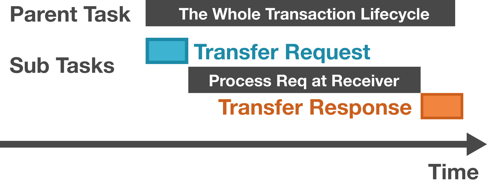

# 2.2 Component

When simulating a complex system, simulator developers typically divide large systems into smaller, relatively independent elements. In Akita, these relatively independent elements are called "Components.” Examples of components include computing cores, caches, and memory controllers.

A single component is not likely to be very useful in a simulation. A full simulation typically requires the interaction between a few components. For example, a computing core may fetch data from the memory to process and write the results back to the memory. To address this problem, Akita introduces a message-passing system to handle component-to-component communication. All the cross-component communication must create messages. The transfer of the messages relies on ports and connections. 

This section will introduce components and the message-passing mechanism. We will first start with the component definition. Then, we will spend most of the section introducing the message-passing systems. Finally, we will give a concrete example (Ping) that demonstrates how the whole system works.

## 2.2.1 Component Definition

A component is also defined as a go interface, as defined below. As seen in the code, it integrates a list of interfaces and also defines two functions. For now, let’s only look at the `Named` and `Handler` interface. We will introduce other methods later.

```go
type Component interface {
	Named
	Handler
	Hookable
	PortOwner

	NotifyRecv(now VTimeInSec, port Port)
	NotifyPortFree(now VTimeInSec, port Port)
}
```

The named interface defines a simple `Name() string` method, which returns the name of the entity. Embedding the `Named` interface requires every component to have a name. Components should be named following a hierarchical style, e.g., `GPU[3].SA[5].L1VCache[0]`. This style is defined by three general rules. First, the name should be hierarchical, with each level separated by a dot. As in the example above, the name represents the Shader Array (SA) within the GPU and the L1V Cache within the Shader Array. Second, the elements should be named in capitalized camel case. Finally, square bracket indices should be added for elements in a series (same configuration). In rare cases (e.g., switches in 2-D meshes), multi-dimensional indices can be added, like `Switch[2][3]`.

We have also introduced the `Handler` interface before. A component is a handler that can handle events. Components typically schedule future events to be handled on their own. For example, when a fixed-latency memory controller receives a read or write request, the memory controller can schedule a future event that completes the read/write action and respond to the original request. 

## 2.2.3 **Message**

Messages are the element that carries the information across components. Below is the definition of the message interface, which only requires the `Meta` method to be defined. Messages’ metadata includes the message ID, source/destination (ports) of the message, send and receive time, traffic class (Traffic class is related to virtual buffer selection, but we have not been really using it), and the traffic bytes (used to determine the latency of sending a message as large messages take longer time to deliver). 

```go
// A Msg is a piece of information transferred between components.
type Msg interface {
	Meta() *MsgMeta
}

// MsgMeta contains the metadata that is attached to every message.
type MsgMeta struct {
	ID                 string
	Src, Dst           Port
	SendTime, RecvTime VTimeInSec
	TrafficClass       int
	TrafficBytes       int
}
```

Developers can implement concrete message types that carry different types of data. For example, we define a memory read request using the code below. 

```go
// A ReadReq is a request sent to a memory controller to fetch data.
type ReadReq struct {
	sim.MsgMeta

	Address            uint64
	AccessByteSize     uint64
	PID                vm.PID
	CanWaitForCoalesce bool
	Info               interface{}
}

// Meta returns the message's metadata.
func (r *ReadReq) Meta() *sim.MsgMeta {
	return &r.MsgMeta
} 
```

As developers defining new messages, they are actually also defining a protocol between the components. We define the memory read protocol as a two step series: 1. the requester send the read request, and 2. the memory data provider response with a `DataReadyResponse`. The protocol also defines (documentation only) that no negative acknowledgement (NAK) or retry is allowed. The data provider should always respond with the data, regardless the latency.

<aside>
💬 Q: Why not simply use function calls? Say the computing core can directly call functions that belong to the memory unit.

A: Several reasons.

1. **Decoupling of Components**: Message-passing allows for greater decoupling between components. Each component operates independently and interacts through well-defined messages. This decoupling makes it easier to modify or replace components without affecting others.
2. **Flexibility in Communication Patterns**: Message-passing supports various communication patterns (e.g., one-to-one, one-to-many) more naturally than direct function calls. It accommodates complex interaction scenarios more efficiently.
3. **Simulation Realism**: In real-world systems, components often communicate through protocols and interfaces rather than direct function calls. Communication incurs latency, which is critical to simulators that are mainly designed for predicting performance. Message-passing more accurately simulates this aspect of system behavior.
</aside>

We consider two special types of messages, requests and responses. Requests are the message that initiates a transaction, and a response is a message that completes a transaction. A request does not have any special fields or methods beyond a standard message, but a response defines an extra `GetRspTo() string` method, as seen in the code below.

```go
// Rsp is a special message that is used to indicate the completion of a
// request.
type Rsp interface {
	Msg
	GetRspTo() string
}
```

We define responses as a special type of message for two reasons. First, it can simplify development. Many requests (e.g., cache invalidation) only require simple acknowledgments (ACK) and there is no need to define a type of response for every type of request. Therefore, we define a general response (shown in the code below) that serve as a general ACK message. 

```go
// GeneralRsp is a general response message that is used to indicate the
// completion of a request.
type GeneralRsp struct {
	MsgMeta

	OriginalReq Msg
}
```

Second, the definition of the response can help improve the visualization. While the detail will be discussed later in the visualization chapter, we can provide a sneak peek here.  We say a request task should have 3 subtasks, including transferring the request, processing the request at the receiver side, and transferring the response. Having a special response type helps us establish the connection between the response and the original request, rather than simply considering the response as a regular, standalone message. As shown in the figure below, the parent task represents the whole transaction. The two colored boxes in the subtasks represent the message transfer. Finally, the mid part is the latency at the receiver side.



The tasks related to requests and responses.

<aside>
💬 Q: Can one component communicate by scheduling an event for another component, rather than sending requests.

A: We do not encourage cross-component event scheduling. This is mainly a consideration of decoupling time management and message passing. It is actually very difficult to implement message passing with events. The sender does not know how busy the network is and cannot find a good time to schedule the event. 

</aside>

## 2.3.4 **Ports**

Ports are attached to components to send or receive messages. Port defines 4 key functions to interact with its owning component, as listed in the code below. 

```go
type Port interface {
	... // Other methods 

  // To send a message through the port.
	CanSend() bool
  Send(msg Msg) *SendError

  // To receive a message from the port.
  Retrieve(now VTimeInSec) Msg
  Peek() Msg
}
```

When a component wants to send a message through a port, it can first check the `CanSend` method or directly try sending the message using the `Send` method. If the required resource is not available, `CanSend` will return false, or the `Send` method will return an error. If the `Send` method returns `nil`, the message will be guaranteed to deliver to the destination some time later. 

Receiving messages requires the component to actively fetch the message from the port using the `Retrieve` or the `Peek` method. `Retrieve` removes the message from the port’s buffer, while `Peek` keeps the message there. If there is no message available in the port’s buffer, both functions returns `nil`.

Although components actively participate in both sending and receiving processes, ports can alert components to changes on the port side. The Component interface includes two functions: `NotifyRecv(now VTimeInSec, port Port)` and `NotifyPortFree(now VTimeInSec, port Port)`, intended for invocation by ports. `NotifyRecv` is called when a message arrives at a port, notifying the component owning the port. Similarly, `NotifyPortFree` is triggered when a port transitions from being unable to accept new messages to being ready for them. For both methods, the port must provide the current time (`now`) and the port instance, enabling the component to identify the notifying port.

Components often have multiple ports to send messages to various destinations, yet each port is exclusive to a single component. For instance, a computing core might have one port connected to the instruction cache and another to the data cache, facilitating access to different data types. Importantly, all ports are bidirectional by default. If unidirectional ports are required, the owning component should restrict its use to either sending or receiving, but not both.

## 2.3.5 Connections

Connections deliver messages from the source port to the destination port. A connection can connect multiple ports, but a port can only link with one connection. A connection can be considered an on-chip network or an off-chip network that routes data across components. The Akita repository provides a `DirectConnection`, which can be considered simple wires that delivers data immediately.

A connection can connect multiple ports but one port can only associate with one connection. To establish the association between the port and the connection, simulator developers can call connection’s `PlugIn` function. The connections will call the `SetConnection` method of the port to notify the port about the connection. 

When there is a message to deliver, the connection injects the message to the destination buffer by calling the port’s `Receive` method. The connection can also call the `NotifyAvailable` method of the port to notify it about that jamming messages can now be transferred. 

<aside>
💬 Q: How is back pressure modeled in akita.

A: Simulating back pressure is vital in computer architecture simulations. Back pressure occurs, for example, when a core connects to a memory controller via a cache. If the memory controller is overloaded, its buffer fills up, preventing the cache from sending further requests. This leads to a request backlog at the cache, causing the core to halt additional memory transactions and stalling the instruction pipeline. Resolving transactions at the memory controller is necessary to resume pipeline flow.

Akita models back pressure using ports and connections, each equipped with buffers. Ports have incoming buffers, while connections have outgoing (in terms of components) buffers. In a connection linking multiple ports, each port is assigned a dedicated outgoing buffer within the connection. When a component needs to send a message, its port requests the connection to buffer the message. If the connection’s buffer is nearing capacity, the send attempt fails, requiring the component to retry later. Conversely, if there is available space, the message is temporarily stored in the connection’s outgoing buffer for subsequent delivery. Before delivering the message, the connection checks for available space in the destination’s incoming buffer. If space is available, the message is transferred from the connection’s buffer to the port’s buffer, where it awaits retrieval by the component.

</aside>

## 2.3.6 A Ping Example

Here, we create an simple simulation to demonstrate how to define components and configure a simulation with ports and connections. We let one component send a ping message to another component. The receiver delays 2 seconds and sends the response.

We first define 2 messages, a Ping Message and a Ping Response. The only information that is carried with the messages is the ping sequence ID (`SeqID`) for the agents to tell which ping message it is.

```go
type PingMsg struct {
    akita.MsgMeta

    SeqID int
}

func (p *PingMsg) Meta() *akita.MsgMeta {
    return &p.MsgMeta
}

type PingRsp struct {
    akita.MsgMeta

    SeqID int
}

func (p *PingRsp) Meta() *akita.MsgMeta {
    return &p.MsgMeta
}

```

We need to tell the agent when to initiate a ping. We create an event for this. Here, we embed a field called `EventBase`. It serves as a base class, providing must-have fields and trivial implementations of getters.

```go
type StartPingEvent struct {
    *akita.EventBase
    Dst akita.Port
}
```

Also, when an agent receives a ping message, it needs to trigger an event that responses to the message. We name the event as `RspPingEvent`.

```go
type RspPingEvent struct {
    *akita.EventBase
    pingMsg *PingMsg
}
```

With all the events and messages defined, we can now start to implement the agent component. We first define the struct and its constructor.

```go
type PingAgent struct {
    *akita.ComponentBase

    Engine  akita.Engine
    OutPort akita.Port

    startTime []akita.VTimeInSec
    nextSeqID int
}

func NewPingAgent(name string, engine akita.Engine) *PingAgent {
    agent := &PingAgent{Engine: engine}
    agent.ComponentBase = akita.NewComponentBase(name)
    agent.OutPort = akita.NewLimitNumMsgPort(agent, 4, name+".OutPort")
    return agent
}
```

In the fields, we see some boulder-plate style field definitions. The `ComponentBase` implements trivial functions such as `Name()`. The agent depends on an `Engine` to schedule events. We, therefore, inject the dependency in the constructor. The ping agent also only has one port connecting to the outside world. We call it `OutPort`. In the constructor, we create the port as the default `NewLimitNumMsgPort`, which can buffer 4 incoming messages.

`StartTime` and `nextSeqID` is the PingAgent-specific states. `StartTime` stores all the out-going ping start time, and `nextSeqID` is the sequence ID of the next ping message to send.

A component needs to implement 3 methods.

The first one is called `NotifyPortFree`. It is called when a port's buffer frees up at least one slot. In this example, we do not need to use this function. So we leave it empty. We will see how it is used to improve simulation performance in the next tutorial.

```go
func (p PingAgent) NotifyPortFree(now akita.VTimeInSec, port akita.Port) {
    // Do nothing
}
```

The second is `NotifyRecv`. A port calls this function when the port receives an incoming message. In this function, we first extract the message from the port's buffer with the `Retrieve` function. Since the PingAgent can process both `PingMsg` and `PingRsp`, we use a [type switch](https://tour.golang.org/methods/16) to differentiate the message types and define what happens when the agent receives each type of messages.

```go
func (p *PingAgent) NotifyRecv(now akita.VTimeInSec, port akita.Port) {
    p.Lock()
    defer p.Unlock()

    msg := port.Retrieve(now)
    switch msg := msg.(type) {
    case *PingMsg:
        p.processPingMsg(now, msg)
    case *PingRsp:
        p.processPingRsp(now, msg)
    default:
        panic("cannot process msg of type " + reflect.TypeOf(msg).String())
    }
}
```

When programming Akita, we follow a convention: we "process messages" and "handle events". With this convention, one can quickly determine what the object type from the verb.

When PingMsg arrives, we schedule an event 2 seconds later.

```go
func (p *PingAgent) processPingMsg(now akita.VTimeInSec, msg *PingMsg) {
    rspEvent := RspPingEvent{
        EventBase: akita.NewEventBase(now+2, p),
        pingMsg:   msg,
    }
    p.Engine.Schedule(rspEvent)
}
```

When PingRsp arrives, we find out the send time and print the ping latency.

```go
func (p *PingAgent) processPingRsp(now akita.VTimeInSec, msg *PingRsp) {
    seqID := msg.SeqID
    startTime := p.startTime[seqID]
    duration := now - startTime

    fmt.Printf("Ping %d, %.2f\\n", seqID, duration)
}
```

A PingAgent should also be able to handle 2 types of events. One is the `RspPingEvent` scheduled when the Agent process a PingMsg. The other one is the `StartPingEvent`, which will be scheduled by the main function later. So, we define the third function. Similarly, we use the type switch to determine the type of the event.

```go
func (p *PingAgent) Handle(e akita.Event) error {
    p.Lock()
    defer p.Unlock()

    switch e := e.(type) {
    case StartPingEvent:
        p.StartPing(e)
    case RspPingEvent:
        p.RspPing(e)
    default:
        panic("cannot handle event of type " + reflect.TypeOf(e).String())
    }
    return nil
}
```

During each event, we need to send a message out. For each message, the sender is responsible to set the source, the destination, and the send time.

```go
func (p *PingAgent) StartPing(evt StartPingEvent) {
    pingMsg := &PingMsg{
        SeqID: p.nextSeqID,
    }

    pingMsg.Src = p.OutPort
    pingMsg.Dst = evt.Dst
    pingMsg.SendTime = evt.Time()

    p.OutPort.Send(pingMsg)

    p.startTime = append(p.startTime, evt.Time())

    p.nextSeqID++
}

func (p *PingAgent) RspPing(evt RspPingEvent) {
    msg := evt.pingMsg
    rsp := &PingRsp{
        SeqID: msg.SeqID,
    }
    rsp.SendTime = evt.Time()
    rsp.Src = p.OutPort
    rsp.Dst = msg.Src

    p.OutPort.Send(rsp)
}
```

One thing you may have noticed and we have not discussed yet is how we applied locks. It is crucial to apply locks as the simulation runs in parallel. Two events of the same component may be handled by two threads simultaneously. Message receiving can also happen at the same time.

Remember, we do not allow inter-component field access? Locking is very simple as we only need to lock the whole `Handle` and `NotifyRecv` function. It is very not likely to create race conditions and deadlocks.

Now the only task is to write the main function and connect everything. In this example, we define an Engine, a connection, and two PingAgents.

```go
engine := akita.NewSerialEngine()
conn := akita.NewDirectConnection("Conn", engine, 1*akita.GHz)
agentA := NewPingAgent("AgentA", engine)
agentB := NewPingAgent("AgentB", engine)
```

We connect the two agents together with the following code. Here, the second argument of the PlugIn function tells the receiver side buffer size. It is safe to set it as 1 for now.

```go
conn.PlugIn(agentA.OutPort, 1)
conn.PlugIn(agentB.OutPort, 1)
```

Finally, we schedule two events and start the simulation. You should see the output for two messages. Both the latencies are 2 seconds.

```go
e1 := StartPingEvent{
    EventBase: akita.NewEventBase(1, agentA),
    Dst:       agentB.OutPort,
}
e2 := StartPingEvent{
    EventBase: akita.NewEventBase(3, agentA),
    Dst:       agentB.OutPort,
}
engine.Schedule(e1)
engine.Schedule(e2)

engine.Run()
// Output:
// Ping 0, 2.00
// Ping 1, 2.00
```

In summary, the Akita framework utilizes simple conceptions, including events, messages, ports, connections, components, to define a simulation. Users need to define events, messages; and implement messages; to simulate customized systems.

The existing simulation model is sufficient for most of the simulation requirements. However, we do feel it challenging to implement a pure event-driven simulation. A Ping Agent already involves 2 event types and 2 message types. Complex components such as caches may involve a large number of events and messages, making understanding the logic extremely challenging. On the other side, traditional cycle-based simulation has the advantage of simplicity. In the next tutorial, we will see how we use the exiting Akita framework to implement cycle-based simulation while still maintain high performance.