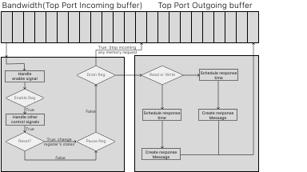

# Memory Control Protocol

Authors: Daoxuan Xu, Yifan Sun,

// Describe signal and state

one msg on

Incompatible signals or states

- If signal’s `Enable=True`, all other fields are ignored. If we need invalid then disable, send 2 signals.
- If the component’s `Enable=False`, the next signal must have `Enable=True`.
- If the component’s `Drain=True` or `Flush=True`, the component will not receive new signals.
- A signal cannot have both Drain and Flush be True. However, a controller may send a flush signal immediately after a drain signal.

A few types of signals are allowed.

- Enable, disable  — only one bit. Immediate response.
- Pause, continue — only one bit. enable = true Component must be enabled.
- Flush command = enable, pause, drain, flush. Delayed response.
- Drain command = enable, pause, drain. Delayed response.
- Invalid command = enable, pause, drain, invalid. Delayed response.

Invalid content: 

Pause command

pause → disable

enum

| Enable State | Enable | Discard | Drain | Flush | Invalid | Meaning |
| --- | --- | --- | --- | --- | --- | --- |
| 0 | 1 | x | x | x | x | Enable the component, continue execution |
| 1 | 1 | x | x | x | x | Not allowed, panic, cannot enable again |
| 0 | 0 | x | x | x | x | Not allowed, panic |
| 1 | 0 | 1 | 1 | x | x | Not allowed, cannot both drain and discard |
| 1 | 0 | 1 | 0 | x | x | Discard transaction |
| 1 | 0 | 0 | 1 | x | x | Drain transaction |

# Overall Protocol

The memory control protocol contains the following signals: 

| Signal/State name | Function |
| --- | --- |
| Enable[state] | The enable state is the switch of the whole component. The component works only if the enable is `true`. The component cannot receive any control signal or receive/respond to any request from/to outside if the enable is `false`. |
| Pause[state]  | The pause state controls the component to stop receiving/responding to any request from/to outside. However, the component can still receive and process control signals. |
| Reset[signal] [Remove] | The reset signal resets all control signals’ states to initial states.  |
| Drain[state] | The drain state lets the component finish all memory requests that have been received. The request will not be processed if it is in the incoming buffer.  |
| Invalidate[signal] | The invalidate state stops all behaviors of the component and deletes all memory requests and responds in buffer. |
| Flush[state] | The flush signal is used to replace old data with new data,  |
| General Response | When a component finishes one of the process signals, the component will generate a general response message to respond to the control signal.  |

# Ideal Memory Controller

The ideal memory controller is a component of Akita that mimics DRAM/HBM work. The ideal memory controller responds to read/write requests with a fixed cycle, which allows users to control memory access speed easily. 

Ideal memory controller’s work flow shows above. It is consisted by a top buffer, control signal work flow, and ideal memory controller work flow.

**Bandwidth & TopBuffer**: We use a buffer to store all incoming messages(memory control protocols, read requests, and write requests). The ideal memory controller processes messages sequentially, we use the number of messages are processed by ideal memory controller per `tick` to simulate the bandwidth. For example, suppose a message is 16 Byte, the bandwidth is 16GB/s. The ideal memory controller will fetch messages from the top port 1073741824(1024 * 1024 * 1024) times per `tick`.

**Control signal processing part:** After fetching message from top port incoming buffer, the message will be sent to the control signal processing part. The control signal in ideal memory controller contains `enable` , `reset` , `pause` , and `drain` . The function of those control signals are described in overall protocol part. 

- The message will be identified first, if the message is a control signal, it will process the control signal processing flow and change the control flags’ states. If the message is a memory request, the memory request processed or not depends the control flags’ states.
- The enable signal is special, since it controls the whole ideal memory controller. Thus, the enable signal is processed first and individually.
- The reset signal has the second priority controls the state changes of pause and drain.
- If pause happens, the ideal memory controller stops to process memory requests immediately but still can process control signals.
- The drain signal means the ideal memory controller will finish all memory requests in this `tick` .
- All control signals take effect(enable and pause) or finished(reset and drain). The ideal memory controller will generate a response message to the component that generates this control signal.

**Memory request processing part:** If the ideal control signal could process memory requests, the memory request goes to next step, memory request processing part. In this part, the memory request will be identified first, read requests and write requests, both of them have the same processing flow but different response messages. The response message is generated immediately and when it will be sent back to the top port outgoing buffer depends on the latency that defined by user. 

# DRAM

# Cache

# TLB