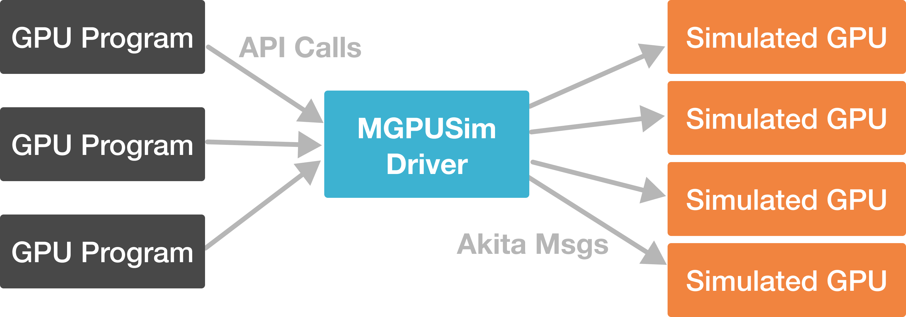
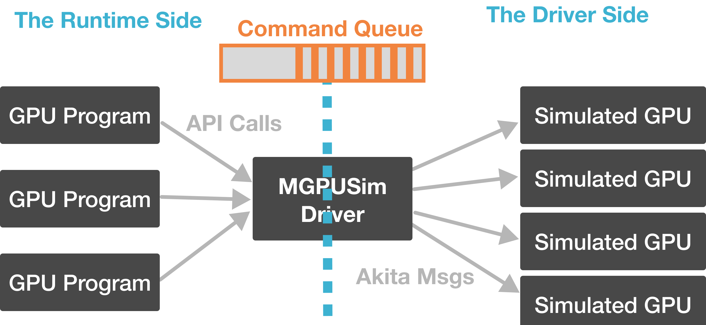
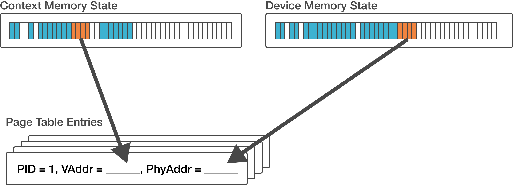

# 5.1 The GPU Driver

The driver serves as the interface between the GPU program and the GPU hardware being simulated by providing a set of GPU-programming APIs, as we have introduced in [MGPUSim: Preparing New Experiments](../Chapter%204%20MGPUSim%20Use%20Guide%20%5BNot-started%5D%20a146678de6a94ca68d1171fea021e95c/MGPUSim%20Preparing%20New%20Experiments%209b85ee8759064ddab8f0b745bab97057.md). From the user's perspective, the driver takes the API calls from the benchmark programs and triggers actions on the GPU side, as demonstrated by the figure below.



If we try to understand the Driver from a developer’s perspective, it is a very special component. One the one side, the driver needs to connect with the GPU program. We call this side the runtime side. These APIs run in the GPU programs’ threads. On the other side, the driver run as a ticking component that sends messages to GPUs. We call this side the driver side. 



To connect these two sides, we uses command queues. Command queues are buffers of the commands to be executed on the GPU side. The process is introduced in [5.1.4 Command Handling](5%201%20The%20GPU%20Driver%20570a7fb5a97a4d21b461bc5ced4cbe3f.md).  Also, since the driver are the place where the simulation is triggered (when some APIs are called), the driver needs to control the start of the event-driven simulation engine. The mechanism of how the driver controls the event-driven simulation engine is introduced in  [5.1.3 Driver-Engine Connection](5%201%20The%20GPU%20Driver%20570a7fb5a97a4d21b461bc5ced4cbe3f.md). 

The rest of this section will focus on the internal mechanism of the Driver component and explain how API calls are implemented and converted into messages. 

## 5.1.1 Memory Allocation

The driver allocates memory with the help of a memory allocator (located in `mgpusim/driver/internal/memoryallocator.go`).  Here is the interface of the memory allocator. We will introduce each function. 

```go
type MemoryAllocator interface {
	RegisterDevice(device *Device)
	GetDeviceIDByPAddr(pAddr uint64) int
	Allocate(pid vm.PID, byteSize uint64, deviceID int) uint64
	AllocateUnified(pid vm.PID, byteSize uint64) uint64
	Free(vAddr uint64)
	Remap(pid vm.PID, pageVAddr, byteSize uint64, deviceID int)
	RemovePage(vAddr uint64)
	AllocatePageWithGivenVAddr(
		pid vm.PID,
		deviceID int,
		vAddr uint64,
		unified bool,
	) vm.Page
}
```

`RegisterDevice`. When the platform is built, the configuration code should register the device with the driver so that the driver can allocate a physical address range for the device. For example, if the first device has 4GB memory, the driver will assign physical address range 0 - 4GB to this address. Then, if the next device has 8GB memory, the driver allocates 4 - 12 GB. This design ensures that the physical address never overlaps. 

`GetDeviceIDByPAddr`. This function looks up the device ID by the physical address. It will simply traverse all the devices and check if the given address is in the physical address range of the device. 

`Allocate`. This function allocates memory (see the figure below). To allocate a piece of memory, we acquire the data structure that records what memory is allocated for the context and the data structure that records what memory is allocated on the device. On the context side, we find an available virtual address, and on the device side, we find an available physical address. We associate these two addresses by creating page table entries that records the PID, the virtual address, and the physical address. Note that, for now, we allocate whole pages no matter how small a buffer the user wants to allocate. 



`AllocateUnified`. This function is basically the same as `Allocate`. The only difference is that the page table entry is marked as `Unified` so that the page can be migrated across GPUs. 

`Free`. Free the buffer so that it can be reused. For now, this function is not implemented as we have never encountered a case where the memory is not sufficient. 

`Remap`. Remap moves some pages (identified by the PID, virtual addresses, and byte size) to another GPU by modifying the page table entries of related pages. It involves freeing physical pages on the original GPU and allocates data on the target GPU. Note that this function only modifies the page table but never moves data. So it should be used before the data is initialized. 

`RemovePage`. Removes a page from the page table. The removed page can be reused in future allocations. 

`AllocatePageWithGivenVAddr`. This function is similar to `Remap`. It allocates a new page on the given device, but with an existing virtual address. The page table entry that associated with the virtual address will be modified. The physical page is freed on the original device and allocated on the target device. 

## 5.1.2 Kernel Launching

Launching a kernel involves slightly more than a command. This is because a kernel involves a few pieces of memory to be copied to the GPU side, including the HSA code object, kernel argument, and kernel launching packet. The HSA code object includes the instructions to execute and is encoded in a binary format. The kernel argument is a small piece of memory that carries the data to be passed to the kernel. The kernel launching packet includes kernel launch information, including kernel size, block size, shared memory size, etc. Therefore, the kernel launching API will allocate the data and create 3 memory copy commands before adding the kernel launching command to the command queue.

## 5.1.3 Driver-Engine Connection

The program to be simulated needs to call driver API to trigger an action on a GPU (e.g., memory copy, kernel execution). When a GPU action is triggered, the driver needs to start the event-driven simulation engine so that the hardware component can execute the program. 

The driven uses a complex mechanism to ensure that the engine runs when it is necessary. We will explain the mechanism here. 

First, the driver defines a `Run` method, defined as below. Other than logging that the simulation starts, the `Run` method starts an always-running goroutine using the `runAsync` method. This `Run` method should be called when the driver is instantiated. 

```go
func (d *Driver) Run() {
	d.logSimulationStart()
	go d.runAsync()
}

```

The `runAsync` method (see code below) is always running to listen to signals from two channels (i.e., the `driverStopped` channel and the `enqueueSignal` channel. Here, we focus on the part of how we handle enqueue signals. 

```go
func (d *Driver) runAsync() {
	for {
		select {
		case <-d.driverStopped:
			return
		case <-d.enqueueSignal:
			d.Engine.Pause()
			d.TickLater(d.Engine.CurrentTime())
			d.Engine.Continue()

			d.engineRunningMutex.Lock()
			if d.engineRunning {
				d.engineRunningMutex.Unlock()
				continue
			}

			d.engineRunning = true
			go d.runEngine()
			d.engineRunningMutex.Unlock()
		}
	}
}
```

When there is a value being injected into the `enqueueSignal`, the driver knows that there are some commands in the command queues and needs to start the engine to trigger hardware execution. 

The first thing to do is to schedule a tick event in the next cycle using the `TickLater` method. Since all the commands are currently stored in the driver, a tick can trigger the driver to start dispatching the command to the GPUs. The `TickLater` method is surrounded by engine pause and continue to prevent a race condition (reading the current time of the engine while the engine may be updating the current time).

Next, we check if the engine is running. We protect the field with mutex. If the engine is not running, we start the engine in a dedicated goroutine and mark the `engineRunning` flag as true.  It is critical to prevent two engine threads from running in parallel, as running the engine in two threads will create a race condition and interrupt the timing logic of the engine. 

The `DrainCommandQueue` API is the only location that injects values to the enqueueSignal. This means that when the queues are being drained, the hardware starts to execute. Only injecting values in this function guarantees that the engine can always be triggered when needed. This is because all of our synchronized versions of the APIs are implemented in a way that creates a queue, enqueues the command with an asynchronous version of the API, and drains the Command Queue. 

The design uses a always-running `runAsync` goroutine to trigger [`engine.Run`](http://engine.Run) goroutine allows MGPUSim to easily support multiple GPU programs running on one `Driver` instance. All GPU programs can enqueue tasks and drain queues. The `runAsync` goroutine will serve as a central controller to decide if the engine should run. 

## 5.1.4 Command Handling

Most of the APIs will generate a command in a command queue so that the command can be picked up and executed by the driver’s `Tick` function. For example, a memory copy API call will generate a memory copy command. The kernel launching command is a bit special. When handling the command, the driver simply generates the corresponding messages and sends the messages to the GPU. 

## 5.1.5  Memory Copy

On the API side, processing memory copy API calls is as simple as adding a command into the command queue. 

The only special treatment is for device-to-host memory copy. When a kernel finishes execution, some dirty data may stay in the L2 cache. If we directly copy the data from GPU’s DRAM, we may end up getting some stale data. 

To solve this problem, we add an `L2Dirty` flag to the context. If a kernel is inserted into the command queue before the device-to-host memory copy, we insert a `FlushCache` command before the device-to-host memory copy to force the L2 caches to write dirty data to the DRAM. If we run multiple kernels without device-to-host memory copy in between, flushing L2 caches is not necessary. 

It is slightly more complex when handling the memory copy commands on the driver side. This is because some users may want to model the memory copy time while others may want to skip the modeling of memory copy and focus on kernel execution. While the easiest way to address this need is to use if-else statements in the driver code, considering code cleanness, we use a middleware pattern. In the future, we plan to move all the driver's logic to middleware. 

<aside>
💡 What is the middleware pattern? Is it related to the Chain of Responsibility pattern?
ChatGPT:

The middleware pattern is a design pattern used in software development where various services or layers process a request as it passes through a chain. Each piece of middleware in the chain handles specific tasks, such as authentication, logging, or data validation, before passing the request on to the next middleware or the final destination. The pattern allows for the dynamic composition and flexible modification of request-handling behaviors without modifying the core application logic.

Yes, the middleware pattern is related to the Chain of Responsibility pattern. Both patterns involve processing requests through a series of handlers or processors. In the Chain of Responsibility pattern, each handler decides whether to process the request or pass it to the next handler in the chain. The middleware pattern similarly passes requests through a sequence of middleware, but typically, each middleware processes the request in some way before passing it along, often without explicitly deciding whether to pass control or not. This makes the middleware pattern particularly suitable for managing cross-cutting concerns in web applications and services.

</aside>

A driver middleware can process commands and messages. We provide two pieces of memory copy middleware, including the `defaultMemoryCopyMiddleware` and the `globalStorageMemoryCopyMiddleware` (copies memory magically and takes no virtual time). 

Let’s focus on the `defaultMemoryCopyMiddleware` to see what messages it needs to send to the GPU side. Theoretically, we can send a single message to the GPU to perform the memory copy operation. However, a practical problem is that we cannot assume the data is on the GPU. Even worse, the data may have been distributed to multiple GPUs. To solve this problem, we leverage the design that a page must only exist in one GPU, we break down the command into page-level messages, identify the page owner GPU according to the page table, and send the message to the GPU that owns the page. 

## 5.1.5 Unified GPUs

MGPUSim natively supports unified multi-GPU systems. The unified multi-GPU feature hides multiple physical GPUs behind the interface of a single GPU. Unified multi-GPUs allow programs written for a single GPU to run on a multi-GPU platform without modification.  

Support for unified GPUs starts from a driver API named `CreateUnifiedGPU`. The API takes a context and a list of GPU IDs as arguments and returns a new GPU ID. The input list of GPU IDs represents physical GPUs, while the returned GPU ID is a virtual GPU backed by the physical GPUs identified by the input GPU ID list. MGPUSim allows one physical GPU to be used to create multiple unified GPUs. 

MGPUSim’s GPU driver needs to consider unified GPUs when allocating memory or launching a kernel. This is done by a simple if statement. 

```jsx
if d.Type == DeviceTypeUnifiedGPU {
	// Do regular GPU action
	return 
}

// Perform regular GPU action
return 
```

For memory allocation, the driver will split the number of pages to allocate to the underlying physical GPUs.  For example, if 15 pages need to be allocated on a 4-GPU unified GPU, we allocate pages 0-3, 4-7, 8-11, and 12-14 to GPU 1, 2, 3, and 4, respectively. 

For kernel launching, we need to consider two parts. The runtime part (the API implementation) and the driver part (command handling). The launch kernel API needs to create a few extra commands, including copying the code object, kernel argument, and kernel-launching packet to the GPU side. In case the GPU is a unified GPU, these extra memory copies need to be copied to each physical GPU. When the launch kernel command is processed, the MGPUSim driver will divide the kernel into several kernels and launch them on the actual GPUs. Kernel splitting is easily achievable because the kernel launching request can take a `WGFilter` property, determining if the GPU needs to execute the workgroup. Here is how the `WGFilter` is implemented. 

```jsx
req.WGFilter = func(
		pkt *kernels.HsaKernelDispatchPacket,
		wg *kernels.WorkGroup,
	) bool {
		numWGX := (pkt.GridSizeX-1)/uint32(pkt.WorkgroupSizeX) + 1
		numWGY := (pkt.GridSizeY-1)/uint32(pkt.WorkgroupSizeY) + 1

		flattenedID :=
			wg.IDZ*int(numWGX)*int(numWGY) +
				wg.IDY*int(numWGX) +
				wg.IDX

		if flattenedID >= wgDist[currentGPUIndex] &&
			flattenedID < wgDist[currentGPUIndex+1] {
			return true
		}

		return false
	}
```

The `WGFilter` function returns true or false to determine if the GPU should execute the workgroup. The function first calculates `flattenedID` of the workgroup by converting a 3D ID into a 1D ID. Then, the function checks if the `flattenedID` falls in a range recorded by `wgDist`. Here, the `wgDist` calculation follows the same rule with the memory so that the kernel is evenly split across the GPUs with consecutive workgroups assigned to one GPU. We find this splitting method matches the compute threads and the memory pages well, and the inter-GPU communication is the smallest among the few methods we tried.  However, the memory scheduling and the thread scheduling scheme can be easily modified. 

[Discarded](5%201%20The%20GPU%20Driver%20570a7fb5a97a4d21b461bc5ced4cbe3f/Discarded%20d0340b95fd2d4f22992463eb4da6fcbd.md)