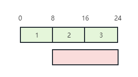
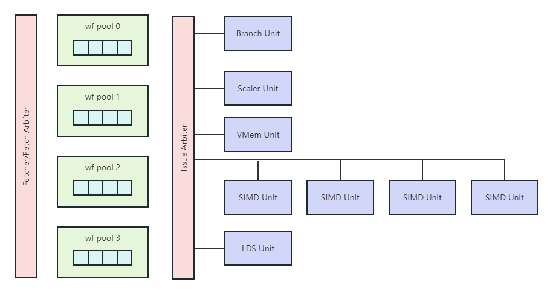

# Compute Unit

Authors: Jiaze E

### 1. Compute Unit (CU) Resources

For each CU, the GPU provides wavefront (wf) pools. For example, wf pool 0, wf pool 1, wf pool 2, WF pool 3… In each wf, there are typically ten wf slots. There are 40 wf slots per CU. Each slot has the basic register resources required to handle one wf.

CU also has a Scalar Register (SReg) File. It contains a group of registers. Everytime we start a wf, we need to know which part of SReg File is allocated to it. Therefore, in each wf, we need a register to remember SReg offset.

Similarly, CU has Vector Register (VReg) Files as well. However, instead of having only one VReg File, each CU has four of them. In each wf, we also have VReg offset which is also similar to SReg offset.

CU has one LDS. Simililarly, we need the LDS offset as well.

When CP dispatch a wf, firstly it would identify a wf slot. Secondly, it would identify the SReg, VReg and LDS offset.

One problem related to dispatching is fragmentation problem. For example, kernel 1 needs 8 SReg per wf and kernel 2 needs 16 SReg per wf. If wf 2 is completed and the resources are free. You cannot fit another wf for kernel 2.

Fragment Problem

Besides, dispatching takes time. We can dispatch one wf per cycle per kernel. If the wf execution time is short, dispatching can then be a performance bottle.

### 2. Calculations

Here are some calculations related to CU.

(1) 1 CU has 40 wf slots. 1 wf is 64 threads. How many wf/threads are executing in 1 CU?

- 40 * 64 = 2560 threads

(2) R9 Naro has 64 CUs. How many threads are executing?

- 2560 * 64 = 163840 = 164K threads = 2560 wfs

(3) CPU has 128 cores and the hyperthreading is 2. How many threads are executing?

- 256 threads executing, which is far less than 164K

(4) What is the occupancy?/How many wf slots are being used?

- E.g. If only 1 wf can stay in 1 wf pool, then the occupancy = 10%

(5) 1 cycle per wf. How many wfs are there?

- 2560 cycles to come back to the same wf slot.
- Therefore, if your wf execution time is shorter than 2560 cycles, then dispatching will impact the performance.

(6) 16 lanes per SIMD, 4 SIMD per CU, 64 CU per GPU. How many instrunctions (insts) per cycle per GPU?

- 16 * 4 * 64 = 40% insts/cycle/GPU
- GPU is mainly based on Thread-level Parallelisum and Data Parallelism, having high throughput. CPU is mainly based on Instruction Parallelisum, haing low latency.

(7) Frequency of R9 Naro is 1.0 GHz. How many insts per second per GPU?

- 4096 * 1G = 4 trillion insts per cycle

### 3. CU Architecture

CU Architecture

CU is combined with Fetch/Fetch Arbiter, wf pools, Issue Arbiter, Branch UNit, Scaler Unit, VMem Unit, four SIMD Units and LDS Unit.

Fetch/Fetch Arbiter decides which sf can fetch insts. Then it would fetch send request to the inst memory.

Issud Arbiter decides which wf can execute insts.

Frontend and backend has many meanings. For compiler, fronted is from tockens to AST and backend is from AST to machine binary. For GPU architecture, fromtend is from command processor to CU and bachend is from CU to DRAM. For CU/core architecture, fronted is fetcher to inst buffer and backend is the execution unit or ALU.

The process from the inst buffer to execution unit is Issue. Issue width is the number of insts that can be issued per cycle.

The issue in each cycle has two steps. Firstly, it would select a wf pool. Secondly, it would identify wfs to issue. There are ten candidates and five of them would be selected. There are three principles for issue in each cycle. Firstly, the wf must not have running inst. Secondly, no true wf can go to the same unit. Thirdly, unit must be available.

There four SIMD Units in the CU architecture. The four wf pools and four SIMD Units are 1-to-1 mapping. Issues happens at 1/5/9/13/17… cycles. Within the SMID Unit, there are Floating Point ALUs. There are 16 ALUs/lanes. Therefore, 16 thread-level insts per cycle. Four cycles to process one wf level inst.