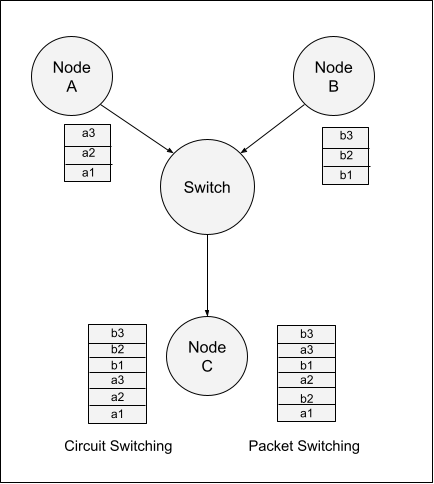
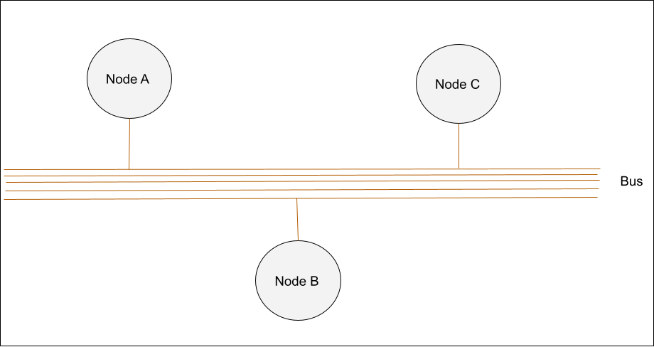
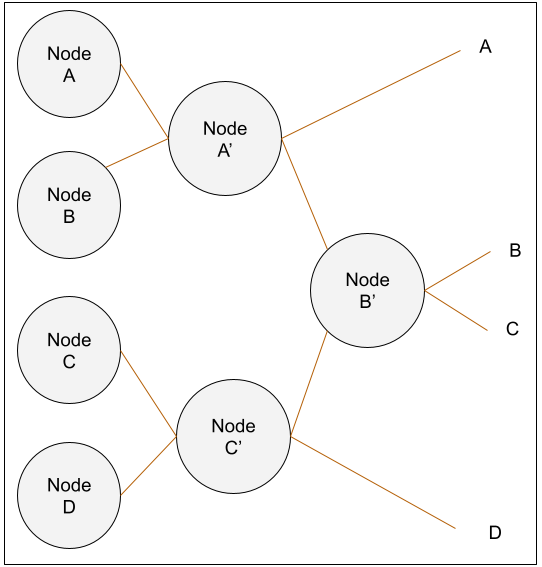
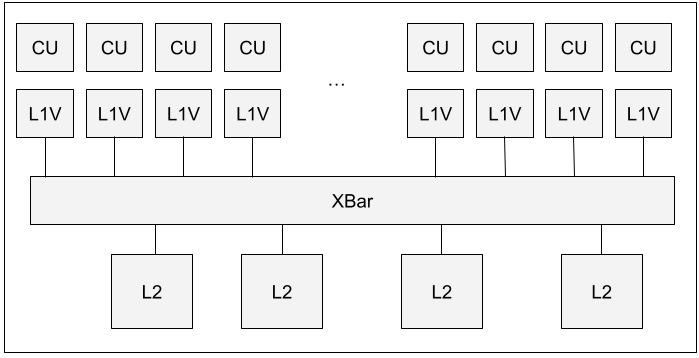
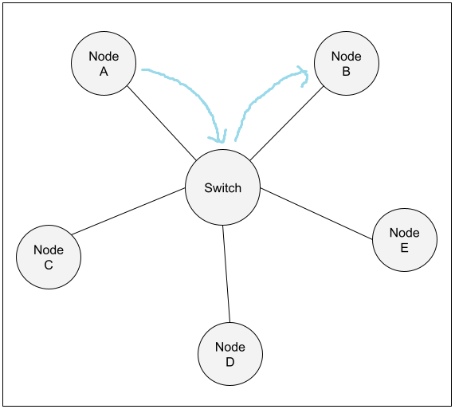
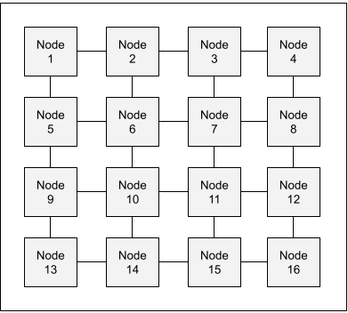
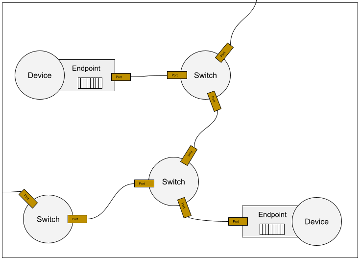
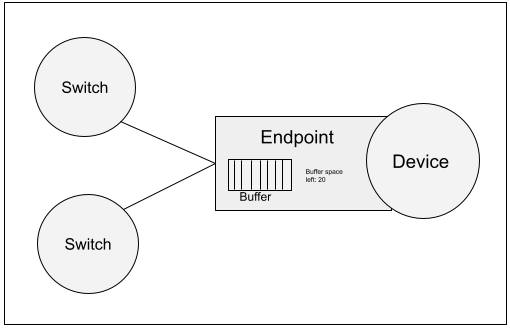
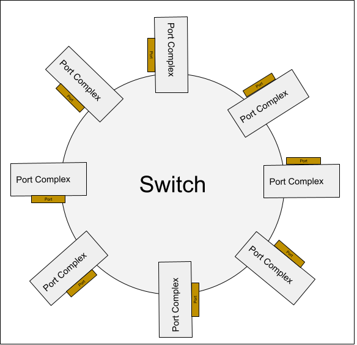

# Networks

Networks are crucial to computer infrastructure. Obviously the internet itself is a network, but even within a single chip a network is required in order for the different components to communicate. The simplest network connects just two components, for example, the core and the L1 cache. These connections are traditionally copper wires, and carry addresses and data.

.png)

Though very simple, the above diagram counts as a network! However, we cannot stop at just two components. If we can create more than one port per node,  we can connect more components, and thus construct a more complex network-on-chip.

## Packet Switching

However, if a node has multiple ports, and different components all wish to communicate at once, the multi-ported node must handle receiving multiple messages at once and making sure that all the messages end up at their correct destinations. This is effectively the same task that an old-fashioned telephone switchboard operator performed, connecting calls to the correct receivers. Solving this problem is the core of the computer network, and is handled by a component called a switch. A switch keeps track of which messages need to go where, and routes them to its proper outgoing port, solving the correct destination problem.

How can a switch handle multiple messages at once? Handling messages takes time, and every message sent requires resources and space on the path between its source and destination, so it is not actually possible to handle messages simultaneously. A simple solution would be circuit switching, where the switch receives a complete message from Node A, then turns its attention to the message from Node B, and so on. However, what happens when the message from A is delayed, or is extremely long, delaying Node B’s message unfairly?

The solution to this is packet switching. Every message is divided into smaller units called ‘flits.’ The size of a flit is the number of bytes which can be transferred within one cycle, and is thus dependent on the number of wires available for data transfer. As the largest one-cycle data unit, flits cannot be broken down any further.

The below diagram demonstrates the difference between circuit and packet switching. Both Node A and Node B are sending data to Node C at once. If the switch uses circuit switching, Node C will receive all of Node A’s message first, then all of Node B’s. With packet switching, it receives the two messages bit by bit, alternating between Node A’s and Node B’s.

### Switch implementations

There are multiple ways to implement a switch in a real network-on-chip. A very simple method is the bus topology:

This is one step up from the simple network we saw at the beginning of the chapter. The problem with that ordinary wire connection is that it only connected one-to-one.  A bus, however, is a group of copper wires which connects to multiple nodes at once. Every node can read and affect the voltage of the bus wires. Thus, if Node A wants to communicate data, it can simply send it to the bus, and Nodes B and C will automatically be able to read that data.

The advantage of the bus structure is that it is simple, and good for broadcast. It also maps well to cache coherency protocol, as a broadcast to invalidate cache data is easy. However, a disadvantage is that it requires access control, otherwise two nodes may attempt to change the voltage at once. This leads into the second limitation, which is that there is limited bandwidth, and only one node should write to the bus at once. Every other node attached must wait its turn to send data.

Another possible switch topology is the Crossbar (also written X-bar), displayed in the diagram below:

.png)

A crossbar is a 3D grid of wires, with the horizontal wires on one level and the vertical ones below them. This diagram shows Node A sending a message to Node C along its horizontal wire, then down to the vertical wire which connects to C. In a crossbar model, each sender can send to multiple receivers at once, but each receiver can only receive data from one node at a time. Thus, any overflow messages sent must be buffered (the striped rectangles) on the receiver end, in case there are multiple senders attempting to contact the receiver simultaneously. Compared to the bus topology the crossbar has higher performance; however, due to the three-dimensional nature of the setup, it takes significantly more space than a bus topology. 

Another implementation which uses the term X-bar is shown in the following diagram

This is an incomplete diagram but enough to demonstrate how the signals propagate through intermediate nodes to reach their destinations. This is slower than the other two implementations, as it requires multiple cycles to pass through the intermediate nodes, but requires fewer connections.

Both the crossbar and bus implementations are functional switches, and all following switches in this chapter could be implemented either way.

### Switch Topologies

There are different ways to set up switches to connect nodes to one another efficiently. A very simple method would look like the Y-diagram earlier in the chapter which demonstrated packet vs. circuit switching.

Another relatively lightweight example is in a shader array.

 For this purpose, the L1V caches need to be able to communicate with every L2 cache, and vice versa. However, the different caches at the same level do not need to communicate with one another. Thus, a lightweight x-bar topology can be efficient because it does not need to implement connections within the sets of L1V caches or within the sets of L2 caches, but only between the sets.

Star topology:

A star topology is what it sounds like, a central switch surrounded by nodes. There are only ever two hops between any two nodes. This topology is common for computer networks, but is not practical for chips, as it is only possible to squeeze so many nodes physically next to the switch.

Mesh topology:

In the mesh topology, every node functions as a switch, passing on messages to one another. The number of hops between any two nodes is simply Manhattan distance - the number of horizontal hops required plus the number of vertical hops required. For networks on chips, this is an improvement over the star topology, as this setup uses the two-dimensional rectangular chip space more efficiently. However, the maximum distance between nodes can be far and inconsistent. For example, in the diagram above, it would take six hops for Node 1 to communicate with Node 16, while Nodes 6, 7, 10, and 11 never require more than four hops when communicating with any node.

Torus topology:

.png)

The torus topology is an improvement over mesh, in which the end of every row and column wraps back to the beginning. This solves the previous problem, as now Node 1 can communicate with Node 16 in only two hops, through Node 13 or Node 4. However, this requires a long communication path between the beginning and end of each row, which is hard to implement on a physical chip.

Some other switch topologies include Butterfly, Dragonfly, and Fat Tree, but we will not further discuss them here.

## Network Routing

Now that we generally know how a switch works, how does the network as a whole work? There are three important elements of the network:

1. Endpoint
2. Switch
3. Connections

The device which uses the chip does not know the implementation of these elements. For all it knows the network could be a simple direct connection or a whole network of switches.

The endpoint is connected to a device, and is responsible for breaking down outgoing messages into flits and reassembling arriving flits. This will be further explained in a bit**.** The connections are usually wires. In MGPUSim, these connections are simulated.

As previously discussed, the switch is responsible for sending incoming messages out through the correct outgoing port. Depending on the implementation, the switch may reassemble arriving flits, or simply pass them through as they arrived. A PCIe network reassembles before sending out in order to preserve message integrity, but on-chip networks usually simply send flits in order to save time and effort. MGPUSim follows the on-chip model. Each switch contains a routing table which maps the final destination port to the correct output port for that switch. There can be many switches along the route, and the switch itself does not know how close to the final destination it is.

An example routing network is shown below. There could be arbitrarily many switches between two devices which wish to communicate, and neither the devices nor the switches know exactly how many there are. Each switch knows which of its ports to route the message through, and simply sends the message out through that port to its destination, where it is picked up and handled by the next switch in line until eventually it reaches the endpoint of the destination device.

## Buffering

### Flit Reassembly Buffer

Recall that messages are not sent as a unit, but split up into many flits with packet switching. An endpoint cannot reassemble a message until it has received all that message’s flits. Because an endpoint may be receiving flits from several messages at once, the endpoint needs to store the flits in a buffer until it has received all of a particular message’s flits and can start the reassembly process. However, this leads to potential deadlock when the buffer is full. At this point, the endpoint can no longer receive new flits - thus meaning it will never receive the final few flits it needs in order to be able to reassemble the partial messages clogging its buffer.

A potential solution could be to drop the buffered messages and ask the upstream switch to resend it, but this is not possible in an on-chip network, as resending the message adds too much overhead. A more feasible solution is a virtual channel. Whenever the upstream port sends a flit from a new message, it also informs the receiver of the total size of the message. If this message size would be too long to fit in the remaining buffer space, the endpoint will tell the switch to wait to send any flits from that message until the buffer has room. When the buffer has sufficient space to receive the message, it tells the switch to send it and then virtually allocates that space so that the buffer size is reduced for the next message.

At present, MGPUSim does not faithfully replicate this technique, but simply doubles the buffer size whenever it runs out of space. This is of course not ideal, as a real chip cannot magically double its buffer size on command, but is done on the assumption that the buffer is not a bottleneck in most real systems.

### Communicating Buffer Fullness

When a switch’s buffer is full, how does it tell its upstream node to stop sending it data? It uses a simple binary on-off control flag. In its connection to its upstream node, it contains a “Ready” wire which only transmits a one-bit signal of ‘1’ or ‘0’. A ‘1’ means that the switch is ready to receive more data, and a ‘0’ means that the buffer is full. If the upstream node receives a signal of ‘0,’ it delays sending data until it receives a ‘1’ again.

.png)

This is a simple strategy, yet it has limitations in a physical chip. The signal is not instantaneous, and never can be unless physicists break the speed of light somehow. Thus, if the channel is long, the “Ready” communication may be slow, trapping bits on the wire between the upstream node and the switch even if the switch itself agreed to stop sending any more data.

## Akita Implementation

Now that we’ve discussed how networks, endpoints, and switches work in general, you’re ready for the details of Akita’s implementation. In Akita, the network-on-chip is implemented using the Builder pattern, which builds the three crucial components of the network: the Endpoints, Switches, and Connections. With these three components, Akita can model any network configuration.

The code for all of these components is in Akita/noc - entirely outside the MGPU Simulator. The *messaging* folder contains the code for the flit and channel implementations. The *networking* folder contains builders for the network connector, pcie, and mesh implementations. Within the networking folder is a *switching* subfolder, which contains the implementations for the endpoint and the switch.

### Endpoint

The Endpoint is implemented as a Ticking Component struct. Its components are as follows:

- Device Ports - owned by the Device, connect the DeviceComponent to the Endpoint
- Network Port - owned by the Endpoint, connects the Endpoint to the rest of the network (Switches)
- flitByteSize
- encodingOverhead - incoming message sizes are multiplied by (1 + this value)
- msgOutBuf (and msgOutBufSize)- buffer to store messages to send out, *before* they are turned into flits
- flitsToSend - buffer to store prepared flits that have not been sent out yet
- assemblingMsgTable - table that tracks which flits have been received from which messages
- assemblingMsgs - where messages that have not been assembled yet are stored
- assembledMsgs - buffer for assembled messages that have not been delivered to the Device yet

The Endpoint handles all messages going to and from its associated device. When the Endpoint receives a message from the Device Port, it attempts to send it by placing it into the msgOut buffer. Then it turns the buffered message into flits and places it into the flitsToSend buffer. Once the flits are prepared, the Endpoint sends the flits out through the Network port.

Upon receiving flits, the Endpoint places them into the assemblingMsgs buffer and logs their arrival in assemblingMsgTable. Once all the flits from a particular message arrive, they are assembled back into a message and stored in assembledMsgs. Finally, the Endpoint tries to deliver the assembled message to the Device Port and thence to the Device. This process is displayed in the following diagram.

.png)

Here is a more detailed description of the relevant functions:

Send():

Receives a message. Checks whether the msgOutBuf is already full. If not, it places the message into msgOutBuf.

prepareFlits():

While there are still messages in the msgOutBuf, or the buffer is more full than the number of output channels **why**, it converts the first message in the buffer to flits and pushes those flits to the flitsToSend buffer. It also starts an End to End task for each flit for logging purposes.

sendFlitOut():

For each output channel, sends the first flit in the flitsToSend buffer out through the NetworkPort

recv():

Checks each input channel for input. If the channel received a flit, this checks what message the flit belongs to and updates the assemblingMsgs and assemblingMsgTable accordingly. It also logs that that particular flit’s End to End task is complete.

assemble():

Checks each message in the assemblingMsgs list to see if all the required flits have arrived. If so, places the assembled message into the assembledMsgs buffer.

tryDeliver():

Sends each assembled message in the buffer to its final destination and marks that message’s End to End task as completed.

### Switch

The Switch is implemented as a portComplex struct. A close-up view of the switch would look like this:

The components of a Switch struct are as follows:

- localPort - the port that handles incoming messages, owned by the port
- remotePort - the port that the switch sends outgoing messages to
- pipeline - holds incoming packets to model the incoming latency
- routeBuffer - buffer for flits between the pipeline and routing
- forwardBuffer - buffer for flits between routing and forwarding
- sendOutBuffer - buffer for flits ready to be sent to the next hop
- numInputChannel - how many flits can be sent out at once
- numOutputChannel - how many flits can be received at once

When handling incoming messages, the local port receives flits and places them into its incoming buffer. Then the incoming flits are processed and placed into the pipeline. After they have been in the pipeline for a sufficient length of time, they are placed into the routing buffer. Then the flits are routed to their correct output port and sent to the forwarding buffer to be forwarded. Once forwarded, they are placed into the sendout buffer, then sent to the remotePort. This process is shown in the picture below.

.png)

Once again, here is a slightly more detailed description of each method in this process.

StartProcessing:

For each input channel of each port, if the channel has an incoming message and the pipeline can accept it, it accepts the flit, turns it into a pipeline item, and gives it to the pipeline

movePipeline:

Ticks the pipeline forward

route(): 

For each input channel of each port, if there is an item in the routing buffer and space in the forward buffer, assign the flit output buffer and push the flit to the forward buffer

assignFlitOutputBuff():

This uses the routing table to look up which port to send the flit out through given its ultimate destination.

forward():

The arbiter decides which input buffer(s) can send this cycle. Then, for each input buffer selected, it checks that there is an item in the forwarding buffer and sufficient space in the output buffer and transfers the flit.

sendOut():

For each output channel of each port, it selects the first flit from the sendout buffer and updates the flit’s source and destination, then sends it out to the remote port.