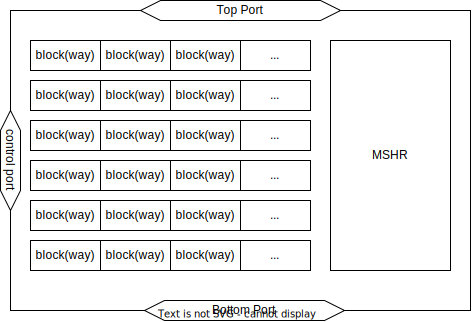

# Virtual Memory

**Authors:** Daoxuan Xu, Yifan Sun

Why virtual memory. Virtual memory is widely used in computing systems. GPUs also use virtual memory starting from XXX (NVIDIA), and XXX (AMD) GPUs. Paper (Jun Yang) 

Now, let’s switch our viewpoint from the computer architecture level to the system level. When a program is executed, the operating system will allocate a block of memory to the program. When several programs are executed simultaneously. If the operating system just has the physical memory address system, the memory allocated to each program is discrete, sometimes, the program might access and modify the memory that does not belong to itself. This operation is risky for the owner of that memory block. The discrete physical memory addresses also disturb programmers’ programming. To avoid the risk of modifying other programs’ memory and provides continuous memory addresses to programmers. The problem mentioned above can be solved by using a technique called virtual memory, a mapping mechanism that maps discrete physical memory addresses to continuous virtual memory addresses. In a system that has virtual memory, at the software level, programs use virtual memory addresses, when programs want to access data, the processer will send the virtual address to Cache or TLB, and the virtual address will be translated to the physical address in Cache or TLB(where to translate the virtual address depends on concrete architecture design). GPU also uses virtual memory starting from GeForce8800(Nvidia) and R600(AMD/ATI). 

Address translation introduces performance overhead. So we need to model them. We basically use three components to model the address translation process, including AT, TLB, MMU.

## Address Translator

Address Translators(AT) are a component that translates physical address to 

## TLB

TLBs are caches of the page tables in the system, that are used to store the recent address of translations of virtual memory to physical memory. The TLB residents between the address translator and memory management unit(MMU). When the processor sends a read/write request, the AT will check the TLB first. If the page table entry is in the TLB, the processor can get the physical address and access the corresponding data without going to the MMU. Implementing TLBs in the system will reduce latency significantly.

The TLBs are organized in a way similar to way-associative caches. A way is also called a block, several ways form a set. Ways carry the page information, wayID, and last visit information. Typically, TLBs are likely to use a fully-associative design. 

In Akita, we define a TLB component with three ports (XXX, XXX, XXX) and three stages (XXX). 

The ports are rensponsible to comunicate with outside. Topport receives XXX, 

Stages include XXX (as implemented [here](https://gitlab.com/akita/mem/-/blob/4a4687ffe651c2e4349174b1c54a33be23356a1a/vm/tlb/tlb.go#L199))

For a set, we can make the look-up operation to find the page, update the new page in the set. The TLB also has two important operations. One is the `evict`. when a way is full, a new page will be added in this way. The way will find the least recently used page, and kick the least recently used page out of the way. The other one is `visit` which is an operation that reorders the order of ways in this set. The way that contains the address that will be sent to the top port will be set as the first way of the set.

Besides the set, we also have an MSHR(missing status holding buffer) to record the address information that cannot be found in TLB and make sure the same request will not be sent to the bottom port twice or more.

The work steps of the TLB in Akita are checking the control request first. The control request is used to flush TLB and restart TLB. For flush TLB, it will pause the tlb, and get a set of virtual addresses from the control port. Deletes such virtual addresses in TLB and resets MSHR. For restarting TLB, it will try to retrieve the message from the top port and the bottom port. 

When a request is sent to the TLB from the Top Port, the TLB will check the MSHR first to find if that request is in the MSHR or not, if the request can be found in MSHR, appending the request to the MSHR(?)

After that, the TLB will look up the request in blocks. If the request can be found in a block, and the Page is valid. The TLB will set this block at the first of the set and then, send the request, Page ID, and page back to the Top Port. If the request cannot be found in a block, check the MSHR status, if the MSHR is not full, add this request to the MSHR and send it to the bottom component to get the physical address.

In the end, when the TLB gets the physical address from the bottom component, then the TLB will check the MSHR to see if the page is in the （）. Then evicts the least recently used page out of the block, set the new page in a block, and places it at the first of the set. The TLB also needs to remove that page in its MSHR.

 

## MSHR

MSHR(Miss Status Holding Buffer), which is also called miss buffer. It is a kind of buffer that saves cache misses information. The MSHR contains several MSHR Entries, Each MSHR entry can save one piece of address and control information. 

The request[n] represents N request messages for data of this address.

ReqToBottom connects MSHR with MMU.

## MMU

MMUs (memory management unit), also called PMMU(paged memory managment unit), which is responsible for the translation of virtual addresses that cannot be found in TLBs to physical addesses in memory. The major component of MMUs is Table Walk Units. All memory access requests from address translators are virtual addresses, the virtual addresses will be checked in TLBs first, if the virtual addresses cannot be found in TLBs, the table walk unit will perform the table walk operation to read the table entries from memory to get the physical addresses.

In Akita, the MMU takes five steps to translation virtual addresses to physical addresses. Including `topSender.Tick`, `send migration to driver`, `walk page table`, `process migration return`, `parse from top`

The first step of MMU is to deal with the first request in the migration queue. it will check the page has already been migrated to the local memory or not(sometimes users use Akita to build a GPU system, two or more GPUs works in a system, the page a GPU needs may locate on the local memory of the other GPU). If the page is not in the local memory, the MMU needs to build a migration request to migrate the page to local memory and update the page table. If the page that requested has already in the local memory, the MMU will send a translation request and update the migration status of the page. 189

the MMU does the walk page table operation. Concretely, the MMU will deal with the translation request that needs to be dealt with in this cycle, if the page that needs to be accessed has not been migrated or is migrating, it will be added to the migration queue and removed from Page Table Walk; once the page in the local page table, it will build a translation response. (sent to where?). Finally, renew the walking translation table. 

Then the MMU will process the migration return operation. The MMU gets the current on-demand migration transaction and sends the response. 

In the end, the MMU will parse the request from the top port, then append the request to the walking translation list.

## Use virtual addressing in caches

Perhaps move this part to AT.