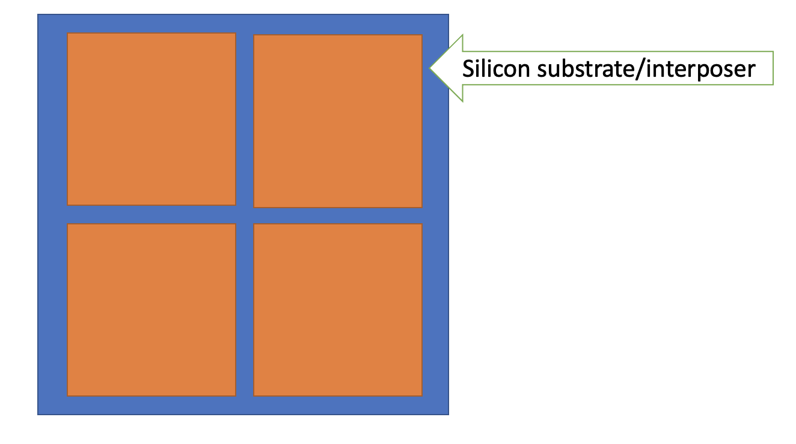
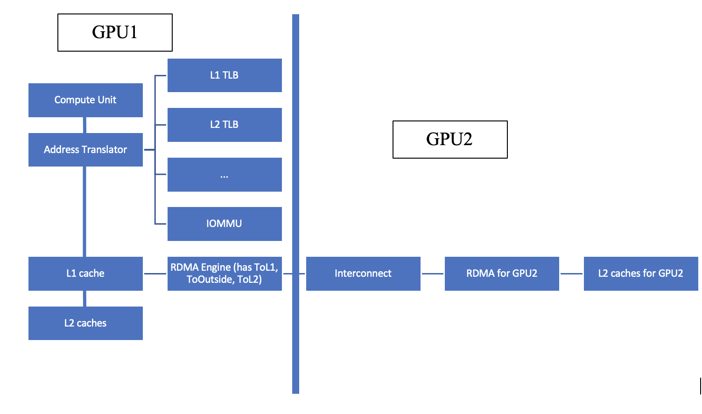

# Chapter 6. Multi-GPU Support in MGPUSim [On-going]

In this section, we will see how multi-GPU execution works and how these multi-GPU execution mechanisms are implemented in MGPUSim.

There two different programming interfaces for multi-GPU simulation:

1. **Regular/True Multi-GPU Execution.** Some examples are CUDA, HIP, OpenCL. In this case, we use an API call such as `cudaSetDevice(id)`. Then, if we launch kernels, allocate memory, etc. all of those actions will be performed on that specific GPU with `id` until we select another GPU. Therefore, the programmer decides where to allocate the data and where to dispatch the threads. A big problem is that we need to change the code extensively to make it a multiple GPU program and include a lot of performance optimizations.
2. Suppose we have a program for a single GPU and somehow we want to use it for multiple GPU systems. Can we support that? We can do this with **Unified Multi-GPU Execution.**

Nowadays, we have **MCM-GPU (multi-chip module) or chiplet** technology.



**`Figure 1: An MCM-GPU`**

Observe Figure 1 above. Basically, with this MCM-GPU or chipset technology, they sell you one big GPU that is much bigger than a traditional GPU with multiple GPU modules. In the figure, you can see there is a silicon substrate/interposer. This is another layer of silicon that can provide communication and can allow the chip to communicate with each other. So, the four GPUs shown in Figure 1 have individual pins that inserted into the silicon substrate so that they may communicate with each other. Manufacturers sell these 4 GPU modules as a single GPU. However, from a programmer’s perspective, it is only seen as one GPU. We have to take advantage of a runtime library (software in user space), driver (software in OS space), or hardware to determine where to place the data and the thread. There are many ways we can do this.

Let’s discuss how MGPU does this.

Suppose we have four GPUs, we use a page interleaving way. If we need 16 KBs of data that will map to four pages as shown in Figure 2 below.


**`Figure 2: This shows the page interleaving of 16 KB of data or 4 pages`**

The underlying assumption is that we do not know how threads will be distributed. If there is a one-to-one mapping, then we can do that. However, it is unlikely that there is a one-to-one mapping for some workloads. In this case, we try to distribute it as wide as possible, so that we can so that we can utilize the memory bandwidth of all the GPUs.

Why do we interleave at a page level? This is because of address translation. Suppose we have the following virtual addresses:

- `0x1000` is a virtual address that maps to physical address `0x1000...1000`
- `0x2000` is a virtual address that maps to physical address `0x2000...1000`
- `0x3000` is a virtual address that maps to physical address `0x3000...1000`
- `0x4000` is a virtual address that maps to physical address `0x4000...1000`

The first digit is the encoding of the GPU. For the first bullet, that would map to GPU 1. Then in the second bullet, that would map to GPU 2. And so on. In the physical address after the ellipses, is the offset within the GPU. This is **consecutive in virtual space**, but **nonconsecutive in physical space**. This actually provides us with flexibility. Because for every access, we need to do the translation, we need to do a table lookup. And if the table is being modified, we actually know where the data is actually located that. In the example above, we could move page 2 after page 3 by mapping the physical address to `0x3000...2000`.

Suppose we have 4 GPUs and a big kernel. For every kernel (1D, 2D, or 3D), we can consider it as an array of workgroups 1 to N. We simply cut the kernel to $N/4,2N/4,3N/4,N$ and each partition will be assigned to each GPU.

Who is responsible for this process? The driver! Every time we launch one kernel, the driver will convert that one kernel launch into four different kernel launches. It will split the kernels will launch four different kernels to the GPUs so that the GPUs can run different workgroups within that range of work groups within a kernel.

Let’s explore some code… In `api.go`:

```go
// SelectGPU requires the driver to perform the following APIs on a selected
// GPU
func (d *Driver) SelectGPU(c *Context, gpuID int) {
	if gpuID >= len(d.devices) {
		log.Panicf("GPU %d is not available", gpuID)
	}
	c.currentGPUID = gpuID
}
```

The implementation for `selectGPU` is simple. We do require a context which is basically storing this current GPU ID as a contextual information. In C++, we have thread local variables unlike Go.  So this `currentGPUID` on the last line of the function is stored in `c *Context`.

Every time we launch a kernel with allocated memory, we actually need to also pass in this `c *Context` to that API. Because of that, the API knows that which GPU we need.

```go
// CreateUnifiedGPU can create a virtual GPU that bundles multiple GPUs
// together. It returns the DeviceID of the created unified multi-GPU device.
func (d *Driver) CreateUnifiedGPU(c *Context, gpuIDs []int) int {
	d.mustNotBeAnEmptyList(gpuIDs)
	d.mustBeAllActualGPUs(gpuIDs)

	dev := &internal.Device{
		ID:            len(d.devices),
		Type:          internal.DeviceTypeUnifiedGPU,
		UnifiedGPUIDs: gpuIDs,
		MemState:      internal.NewDeviceMemoryState(d.Log2PageSize),
	}

	for _, gpuID := range gpuIDs {
		dev.ActualGPUs = append(dev.ActualGPUs, d.devices[gpuID])
	}

	d.devices = append(d.devices, dev)
	d.memAllocator.RegisterDevice(dev)

	return dev.ID
}

```

Next, we have this API called `createUnifiedGPU`. This is very unique for MGPUSim as this API doesn't exist in real GPU programming frameworks. Suppose we have an 8 GPU system, but I do not want to use all of the GPUs. Suppose I want to use 5 of them, I can specify exactly which ones I want to use an create a unified GPU. We would pass in `c *Context` and for `gpuIDs`, we could specify something like `[2,3,5,6,7]`to create a unified GPU. In other words, we do not have to sequentially pick the GPUs (e.g., 4 GPUs do not have to be `[1,2,3,4]`). You could also create another unified GPU like `[3,4,7,8]`. The first unified GPU would have ID 9 and the second unified GPU would have ID 10.

For `AllocateMemory`, we need to pass in the `Allocate` method with the current process ID, how large we want to allocate, and the current GPU ID.

In `kernel.go`:

The `EnqueueLaunchKernel` is the entrance of how we want to launch our kernel. A more common API is `LaunchKernel` that creates an `EnqueueLaunchKernel.`

The `EnqueueLaunchKernel` has an if statement, `if dev.Type == internal.DeviceTypeUnifiedGPU.` If the device is a unified GPU, then we do `enqueueLaunchUnifiedKernel`. Otherwise, we do a single-GPU kernel launching method. The `enqueueLaunchUnifiedKernel` is being modified often. The loop gathers all of the unified GPU IDs. We get their IDs and take different action.

In `driver.go`:

The`processUnifiedMultiGPULaunchKernelCommand` driver component keeps ticking and try to execute those commands one by one. It loops through the GPUs and creates, `NewLaunchKernelReq`, a request sent from the driver to the GPU to start a kernel. This is a command and that is sent by the driver to the command processor. Consider this part of the code:

```go
currentGPUIndex := i
		req.WGFilter = func(
			pkt *kernels.HsaKernelDispatchPacket,
			wg *kernels.WorkGroup,
		) bool {
			numWGX := (pkt.GridSizeX-1)/uint32(pkt.WorkgroupSizeX) + 1
			numWGY := (pkt.GridSizeY-1)/uint32(pkt.WorkgroupSizeY) + 1

			flattenedID :=
				wg.IDZ*int(numWGX)*int(numWGY) +
					wg.IDY*int(numWGX) +
					wg.IDX

			if flattenedID >= wgDist[currentGPUIndex] &&
				flattenedID < wgDist[currentGPUIndex+1] {
				return true
			}

			return false
		}

		queue.IsRunning = true
		cmd.Reqs = append(cmd.Reqs, req)

		d.requestsToSend = append(d.requestsToSend, req)

		queue.Context.l2Dirty = true
		queue.Context.markAllBuffersDirty()

		d.logTaskToGPUInitiate(now, cmd, req)
	}

```

The `req.WGFilter` is an inline function or a function without a name. This is a filter where you want to filter out some workgroups, and we only want to run some workgroups. We don't want to each GPU to run the whole kernel. We want each GPU to only run part of the kernel. If this function returns true, we execute that workgroup. Otherwise, we do not execute that workgroup. We generate a flattened ID for each workgroup. For a two-dimensional case, we would wrap so this can work for any dimension. We only execute within this range: `wgDist[currentGPUIndex] ≤ flattenedID < wgDist[currentGPUIndex+1]`.

A simple example: suppose we have 32 workgroups:

- GPU 1 will execute 0-7
- GPU 2 will execute 8-15
- GPU 3 will execute 16-23
- GPU 4 will execute 24-31

It’s a simple partition, we divide these kernels into smaller kernels, and we send those requests to send. We add it to a list of requests and then the driver will keep sending the requests to the GPUs. We use the code above as a filter, so each GPU knows which workgroups we need to execute. If we need to change this scheme, then we can change the range in the if statement. Here, the driver is responsible for dividing a large kernel into smaller kernels as discussed.

Next, we discuss **Cross-GPU Memory Access.** We always have a problem that one GPU may need to access the data on another GPU. In early GPUs, your program will not be able to tell which GPU the data belongs to. Today, we have a **unified address space**, so an address like `0x2000` will tell us exactly where the data belongs to.

We have to have some mechanism that allows a thread running on one GPU to access data from somewhere else. We have two methods to support this:

- Direct Cache Access
- Page Migration

For **direct cache access**, suppose we have a compute unit. The address translator will translate the address to a L1TLB. Let's assume a miss, let's go to our L2TLB and it still misses until we eventually go to the IOMMU. The IOMMU always have a page table that include pages that belongs to all the GPUs. The IOMMU will realize GPU 1 is trying to access something from GPU2. It can send a reply with the physical address and tell it that it belongs to a different GPU. It will send back up all the way to the address translator and send it to the L1 cache. Recall that the L1 cache has a low module finder which is a table that maps from the address to the port that can provide this address. The L1 cache basically uses an interleaving low module finder. It had three fields: `UseAddrRange` (type `bool`) and `LowAddr`, `HighAddr` (type `unit64`). We can specify the low and high address that it can be in our own GPU and we can try to retrieve from L2 cache. Otherwise, we would use a field called `OutOfRangePort` (type `port`) which is a port that can provide the data service if it falls outside of the range. The L1 cache will have two different paths to process this data. If it’s local, it goes to the L2 cache. The interleaving address low module finder will determine which L2 cache to go to. If it is not local, the L1 cache will send it to the RDMA engine. You can consider this RDMA engine as a network interface. It's just interfacing the network so that these messages can be sent to another GPU.

The RDMA engine has three ports: `ToL1`, `ToL2`, and `ToOutside`. The request will come in from the L1 cache, through the `ToL1` port into the RDMA engine, then `ToOutside`. The RDMA engine does not have any logic, but rather it is a massive forwarder. The RDMA engine has another low module finder. We forward this to `ToOutside`.

For GPU2, there is another RDMA engine that has another `ToOutside` port. There’s a big  interconnect between the two GPUs. In AMD systems, they rely on PCIe interconnects which is generally slower, but the newer version is much faster. For NVIDIA, we would use an NVLink. For distributed systems, the interconnect would be ethernet or InfiniBand. Interconneect are machine to machine communication channels. We'll go through this network, the network about doing multiple hops, and then eventually this message will arrive at GPU2. Still, it doesn't really contain any real logic, it will forward it to it’s `ToL2` port with another low module finder to determine which L2 cache it can retrieve the data. In the case of a miss, it will forward to the DRAM.

The message needs to return back to the L1 cache so it will just traverse backwards. `L2 cache -> ToL2 -> RDMA (GPU2) -> Interconnect - ToOutside -> RDMA (GPU1) -> ToL1 -> L1 cache -> Address Translator -> Compute Unit` with the data ready. The discussion can be illustrated in the Figure 3 below:



**`Figure 3: Direct Cache Access. We go all the way to the IOMMU after a miss and it realizes we are trying to access something from GPU2. It sends a reply back to the L1 cache that uses the RDMA engine to subsequently retrieve the information from the L2 cache in GPU2, passing through the interconnect. Then, the data is sent all the way back to the compute unit to GPU1.`**

Let’s go over the pros and cons of direct cache access. The cons:

- Granularity is either 64 byte or 128 byte
- Latency - for NVIDIA GPUs with NVLink it is about 600 cycles which is a lot of latency compared to accessing our own DRAM.
- We have a lot of metadata which incurs a lot of overhead
- The network is likely to be off-chip so likely to be slow. Bandwidth is low, high latency, and high energy consumption. Therefore, it is not very efficient.
- Also, if we want to access data again and again, and memory placement is not perfect. We will keep accessing remote data and all the communication will go through this remote channel, thus it's very slow. It is less tolerant to misplacement.

The pros:

- Simple, easy to understand and implement

While there are many disadvantages, in the multi-GPU research space or especially in the MCM-GPU/chiplet research, direct cache access is the default method to use. For these disadvantages, particularly being less tolerant to misplacement, is an active research question. If there is a misplacement, can we do something to fix the problem and increase the local access probability?

The next method is **page migration**. Similarly, we go through the L1 cache, L1 TLB, L2 TLB, …, until we get to the IOMMU for the address translation. The IOMMU will realize that we are trying to access something from GPU2. Rather than send a reply, it will say, let’s move this page to GPU1 instead. That way, if we store the page in the DRAM, GPU1 can access that page again. We will not need to do a remote access and we can just do local access.

The IOMMU will tell the driver to start the page migration. The driver needs to do a lot of work to coordinate the GPUs to start the page migration. Suppose the page (on GPU2) has a virtual address of `0x1000` and a physical address of `0x2...1000`. We need to migrate this to GPU1. The IOMMU will change the page table entry to a new physical address with `0x1...1000`. The virtual address cannot change because the compute unit holds virtual address for the GPU so we would not be able to tell what it maps to. The virtual address will never change, but the physical address can change - which yields flexibility. However, future research could focus on manipulating the virtual address.

We should guarantee GPU2 does not have any physical address so that we can modify it otherwise there can be a miss and can be not coherent anymore. GPU2’s AT, L1, etc. may have a transaction storing the wrong physical address. So, as you can see, there is a lot of work, we need to guarantee there is no ongoing transaction on this page. There are hundreds of components, lots of L1 caches, etc. We have to guarantee there’s no such physical address information exists in all our caches.

First, the driver needs to **flush** GPU2 so that no physical address information is stored there. We have to guarantee ongoing transactions are finished. We have to invalidate L1 caches, remove entry in L1 TLB, L2TLB, no ongoing transactions in the compute unit, etc. Currently, there are many bugs regarding this part in MGPUSim that break integration tests.

Second, we have a component called **PMC (Page Migration Controller)**. This next step is **migrate.** The driver will send a message to a page migration controller of the receiver GPU. The PMC works similarly to the RDMA engine. The PMC controller can be connected either to the L2 cache or DRAM. Let's assume we connect the DRAM. So we'll keep pulling this data, of course, sending a read request to the remote DRAM, but it will keep pulling data from this the remote DRAM to this local DRAM so that this piece of information is migrated from the remote DRAM to local DRAM.

Once it’s done, the driver needs to **restart**. So it will tell GPU2, it's good to go you can restart the computing. Otherwise, if GPU2 tries to access this data while migration is happening, it will cause problems. Finally, we will **respond to IOMMU**. It will say the migration is done. A bonus step is the IOMMU will respond to the L2TLB with the new physical address, so the memory access can keep going.

This was a brief overview of the page migration process. It took almost half a year to implement this feature. We had to modify every component, which is something we typically want to avoid. This part is being deprecated because of too many bugs.

Let’s discuss the pros and cons. They contrast the advantages/disadvantages of direct cache access.

The pros are:

- It is more tolerant to misplacement. Suppose threads want to access data but it is elsewhere, we may move the data so that all the following memory accesses are local.

The cons:

- Very, very, complex. It is difficult in the simulator implementation and at the hardware level. It is very difficult to debug at the hardware level.
- **Ping-pong effect**. If both GPUs want to access a part of data, like a convolutional kernel, that’s a small piece of data. We may end up moving a page back and forth which is virtually equal to a deadlock. NVIDIA tries to prevent this by keeping a page migrated for a certain period of time then it either switches to direct cache access or just waits. This can be cumbersome.

Let’s summarize:

- Execution models:
    - Regular execution, e.g., `cudaSetDevice`
    - Unified GPU execution
- Memory model:
    - Direct Cache Access
    - Page Migration/Unified Memory
        - Windows that allow page migration
        - Outside windows use DCA

| Execution model/ Memory model | Regular Execution, e.g., `cudaSetDevice` | Unified GPU Execution |
| --- | --- | --- |
| Direct Cache Access (DCA) | Supported
Command line flag: 
`-gpus=1,2,3,4` | Supported
Command line flag: 
`-unified-gpus=1,2,3,4` |
| Page Migration/Unified Memory
1. Windows that allow page migration
2. Outside windows use DCA | Supported
Command line flags:
`-gpus=1,2,3,4`
`-unified-mem` | Supported
Command line flags:
`-unified-gpus=1,2,3,4`
`-unified-mem` |