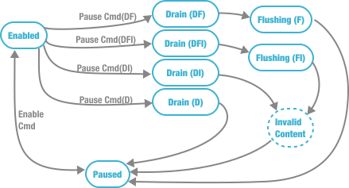

# Page migration

## GPU-GPU page migration
In a NUMA multi-GPU system, after initially allocating data in GPUs, some data is very frequently accessed by remote GPUs. The frequently remote data accessing behavior will introduce non-negligible communication overhead and occupancy of Bandwidth resources. To address this problem, GPU-GPU page migration occurs periodically to move data to an appropriate GPU. The GPU-GPU page migration procedure can be divided into three steps: (1) preparing the page migration, (2) processing the page migration, and (3) finishing the page migration.

Assuming the data that the target GPU needs is located in the source GPU. After TLB returns the physical address, the reorder buffer(RoB) forwards this physical address to the L1 Cache to find the corresponding data. Once the L1 Cache cannot serve this data access request, the data access request will be cached in the L1 Cache's MSHR temporarily. By parsing the physical address of the data access request, if the physical address is out of the range of the local DRAM address, a far page fault occurs, and Remote Direct Memory Access(RDMA) issues this data access request to source GPU. 

The far page fault triggers a far page fault counter that will be augmented to record this far page fault. After the data access request arrives at the source GPM, the source GPM's RDMA promptly sends this request to the source GPU's L2 Cache for further search. The data access request is cached in MSHR and handled by DRAM if it cannot be found in the L2 Cache. Upon finding the corresponding data, this data is sent back to the source GPM's RDMA through the L2 Cache. Finally, the target GPU's RDMA receives this data and responds to the data access request to the L1 Cache. 

In a wafer-scale GPU, high-frequency page migration between GPUs occurs at irregular intervals will bring significant overhead due to pipeline flush and TLB shootdowns. To mitigate this, the MMU will periodically launch(e.g., 10000 cycles) a "page migration phase", during which all pending migration requests are processed in a centralized manner. In this period, the far page fault history that is recorded in the counter will be reported to the MMU. The MMU will decide to migrate the page from the source GPM to the target GPM if the page meets the page migration condition. 

After deciding which page to migrate, on the one hand, the driver will check the IOMMU to find an empty page in the target GPM to store the migrated page. On the other hand, the driver will broadcast a page locking message to all GPMs' command processors. A page locking request is sent by the command processor to let GPMs flush the migrated page to DRAM. This page is also marked as invalid to be accessed until the page migration procedure finishes. When GPMs finish the locking procedure, a message is sent back to the driver to inform the driver that the preparation step is finished. A page-moving message is sent by the driver to the source GPM, and a data-storing message is sent to the target GPM. 

After finishing the page migration preparation, source GPM's RDMA will send a write request to the target GPM with the migrated page data, including flags. The migrated page data, along with the associated flags received by the target GPM's RDMA through the on-chip network. After the target GPM stores the migrated page and associated flags, the page migration completion message is sent to notify the driver that the page migration procedure is finished.  

Upon being notified of the completion of the page migration, the driver promptly broadcasts a resume message along with the new physical address of the migrated page to all GPMs. The TLB check is performed to update the new physical address of the migrated page with the old one. Once the new physical address is updated, GPMs resume normal operation.

Before processing the page migration, the first problem that needs to be addressed is when to process the page migration. To this end, there are several page migration polices have been proposed by researchers. The on-demand page migration is widely implemented in current GPUs

## component by component development
Before modifying components, a new __memory control protocol__ needs to be designed to support page migration. The memory control protocol is used to assign page migration commands that aforementioned and get response message in intra-GPU communication(`driver` to `GPU`) and inter-GPU communication(`CP` to `CU`, `Cache`, `TLB`, `RDMA` and `DRAM`)

The concrete information of memory control protocol shown below:

 

<!--  -->

Incompatible signals or states

- If signal’s `Enable=True`, all other fields are ignored. If we need invalid then disable, send 2 signals.
- If the component’s `Enable=False`, the next signal must have `Enable=True`.
- If the component’s `Drain=True` or `Flush=True`, the component will not receive new signals.
- A signal cannot have both Drain and Flush be True. However, a controller may send a flush signal immediately after a drain signal.

A few types of signals are allowed.

- Enable, disable  — only one bit. Immediate response.
- Pause, continue — only one bit. enable = true Component must be enabled.
- Flush command = enable, pause, drain, flush. Delayed response.
- Drain command = enable, pause, drain. Delayed response.
- Invalid command = enable, pause, drain, invalid. Delayed response.

Invalid content: 

Pause command

pause → disable

enum

| Enable State | Enable | Discard | Drain | Flush | Invalid | Meaning |
| --- | --- | --- | --- | --- | --- | --- |
| 0 | 1 | x | x | x | x | Enable the component, continue execution |
| 1 | 1 | x | x | x | x | Not allowed, panic, cannot enable again |
| 0 | 0 | x | x | x | x | Not allowed, panic |
| 1 | 0 | 1 | 1 | x | x | Not allowed, cannot both drain and discard |
| 1 | 0 | 1 | 0 | x | x | Discard transaction |
| 1 | 0 | 0 | 1 | x | x | Drain transaction |

# Overall Protocol

The memory control protocol contains the following signals: 

| Signal/State name | Function |
| --- | --- |
| Enable[state] | The enable state is the switch of the whole component. The component works only if the enable is `true`. The component cannot receive any control signal or receive/respond to any request from/to outside if the enable is `false`. |
| Pause[state]  | The pause state controls the component to stop receiving/responding to any request from/to outside. However, the component can still receive and process control signals. |
| Reset[signal] [Remove] | The reset signal resets all control signals’ states to initial states.  |
| Drain[state] | The drain state lets the component finish all memory requests that have been received. The request will not be processed if it is in the incoming buffer.  |
| Invalidate[signal] | The invalidate state stops all behaviors of the component and deletes all memory requests and responds in buffer. |
| Flush[state] | The flush signal is used to replace old data with new data,  |
| General Response | When a component finishes one of the process signals, the component will generate a general response message to respond to the control signal.  |

### Overall 
To implement page migration, all aforementioned components need to be modified. The page migration procedure that we discussed earlier can be roughly divided into three stages: preparing page migration, processing page migration, finalizing page migration. In following sections, we will describe in detail each component's behaviors for those three stages.

### Driver modification

### TLB modification
<!-- Only CU needs to execute draining operation, when CU stops continuously execute new tasks, all components will be drained. This opinion needs to be discussed in the next meeting  -->
The TLB is used to cache and translate virtual addresses to physical addresses before GPU performing memory access. During the preparing page migration stage, command processor suspends to assign new tasks to compute units. The compute units will send all address translation requests to L1 TLBs and wait for responses of such address translation requests. When all address translation requests of the current task have been completed, TLBs will be set as pause state and stop to handle new address translation requests until the page migration completes. There is no any operations during the processing page migration stage. However, in the finalizing page migration stage. Since migrated pages have new physical addresses, CUs accesses stale TLB entries can cause illegal page access issues and return wrong data. To avoid this problem, driver needs to broadcast new physical addresses of migrated pages to all GPUs(TLB shootdown) before finalizing page migration. 
